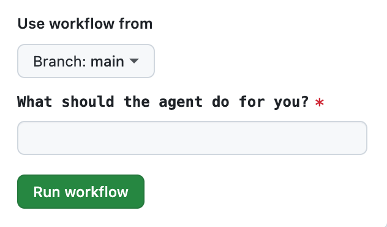
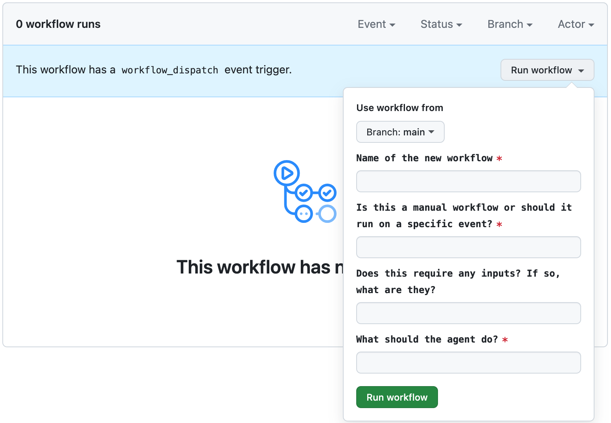

# Smart Project

This project template uses **[Smart Actions](https://github.com/PR-Pilot-AI/smart-actions)** to add agentic behavior to your Github project.
It comes with fully-customizable, no-code [Github workflows](https://docs.github.com/en/actions/using-workflows) out-of-the-box:

## Tools

Tools are workflows you can run manually to interact with your AI agent

### 🚀 Quick Task 
A generic tool that passes on your instructions directly to the agent, who will execute your instructions using its **[agent capabilities](https://docs.pr-pilot.ai/capabilities.html)**.

### 🛠️ Build Something
Instruct the AI agent to build something for you using its **[agent capabilities](https://docs.pr-pilot.ai/capabilities.html)**.

### 🧙‍♂️ Workflow Wizard
Create new workflows tailored to your project using the **[workflow wizard](https://github.com/PR-Pilot-AI/smart-project-template/actions/workflows/workflow_wizard.yaml)**.

## Automations
Automations are workflows that run automatically when certain events occur

### 📝 Format and Label New Issues
When a new issue is created, it will automatically be formatted and labeled according to your [instructions](.bot_instructions/issue_formatting.md).

### 🔍 Instant Pull Request Review
When a new pull request is created, it will automatically be reviewed according to your [instructions](.bot_instructions/pr_reviews.md).

## Setup
It's simple:

1. **[Create a new Github repository using this template](https://github.com/new?template_name=smart-project-template&template_owner=PR-Pilot-AI)**
2. **[Install PR Pilot](https://github.com/apps/pr-pilot-ai/installations/new)** on your repository

That's it! You now have a Github project with agentic behavior. 🚀
